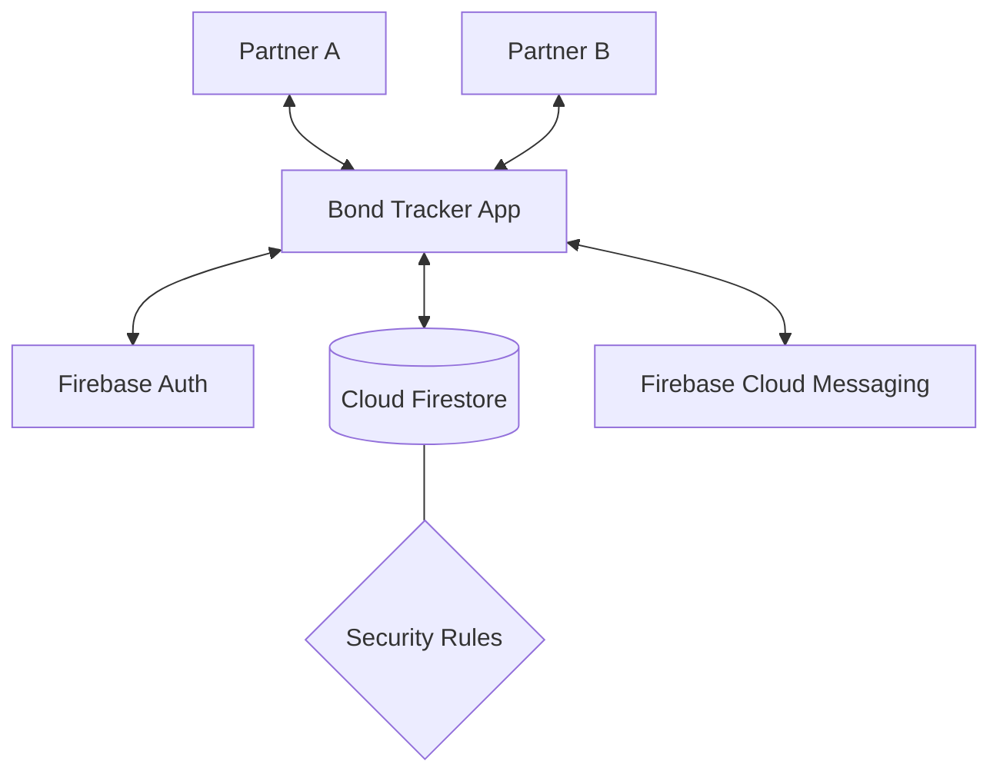

# 💜 Bond Tracker

A sleek, aesthetic couples productivity tracker built with **Next.js 14** and **Firebase**.  
Log your daily activities, track each other's progress, and grow together — privately, beautifully.

---

## 🏗️ Technical Architecture

Bond Tracker is built with a modern, real-time architecture designed for privacy and speed.

### System Overview


### Data Relationship Model
```mermaid
erDiagram
    USERS ||--? COUPLES : "belongs to"
    COUPLES ||--{ ACTIVITIES : "owns"
    COUPLES ||--{ CHECKINS : "owns"
    USERS ||--{ ACTIVITIES : "logs"
    USERS ||--{ CHECKINS : "submits"
    USERS ||--o NUDGES : "receives"
```

---

## ✨ Feature Deep-Dive

### 1. Couple-Only Privacy
The app uses a unique `coupleId` to scope all data. Firestore Security Rules ensure that no user can see activities or check-ins belonging to another couple.

### 2. Timezone Mirror & Intelligence 🌍
Accurate tracking for long-distance partners. 
- **Self-Healing Sync**: The app automatically captures the browser's timezone ID (e.g., `America/New_York`) and saves it to the user's profile.
- **Visual Mirror**: See your partner's exact local time and activity window, calculated in real-time.
- **Smart Streaks**: Streaks are calculated based on the user's local "day", ensuring consistency regardless of where they are in the world.

### 3. Daily Wind-Down 🌙
A nightly ritual triggered after 9 PM.
- **Reflection**: Rate your day (1-5), set a mood, and leave a note.
- **Morning Surprise**: Your partner sees your note as a soft, glowing banner the next time they open the app.

### 4. Data Ownership & Export 📊
- **CSV**: Raw data for spreadsheet analysis.
- **PDF**: A beautiful, print-ready report with themed tables and relationship summaries.

### 5. Instant Nudges 🔔
Uses **Firebase Cloud Messaging (FCM)**.
- **In-App**: Instant toast notifications.
- **Background**: System push notifications even when the tab is closed.

---

## 📁 Project Structure

```bash
bond-tracker/
├── app/
│   ├── layout.js            # Root layout + Google Fonts + Viewport meta
│   ├── page.js              # Auth gateway (Login/Sign Up)
│   ├── onboarding/          # Couple creation & invite system
│   └── dashboard/           # Main interactive hub + Stats logic
├── components/
│   ├── Navbar.jsx           # Global nav + Export dashboard
│   ├── TimezoneOverlap.jsx  # The "Mirror" component with diagnostic ID
│   ├── ProgressRing.jsx     # Animated circular goal trackers
│   ├── ActivityFeed.jsx     # Real-time list of shared logs
│   ├── LogModal.jsx         # Bottom-sheet for rapid activity logging
│   └── WindDownModal.jsx    # Reflection flow
├── hooks/
│   ├── useAuth.js           # Real-time user profile sync
│   └── useTodayDate.js      # timezone-shifted relative dates
├── lib/
│   ├── firebase.js          # Core SDK initialization
│   └── exportUtils.js       # Blob & PDF generation engine
├── firestore.rules          # THE privacy firewall (Couple-scoped access)
└── firestore.indexes.json   # High-performance composite query indexes
```

---

## 🔐 Database Schema & Security

### Firestore Collections
| Collection | Role | Key Fields |
|------------|------|------------|
| `users` | User Profiles | `uid`, `coupleId`, `timezone`, `color`, `lastActive` |
| `couples` | Join logic | `members` (UID array), `inviteCode`, `thinkingOfYou` |
| `activities` | Core logs | `userId`, `coupleId`, `type`, `duration`, `date` |
| `checkins` | Nightly notes | `userId`, `coupleId`, `rating`, `mood`, `note`, `seenByPartner` |
| `nudges` | Pings | `toUserId`, `fromUserId`, `createdAt` |

### Security Philosophy
The `firestore.rules` file enforces **Couple-Scoped Isolation**.  
Example Rule Snippet:
```javascript
match /activities/{activityId} {
  allow read: if request.auth != null && 
    get(/databases/$(database)/documents/users/$(request.auth.uid)).data.coupleId == resource.data.coupleId;
}
```

---

## 🚀 Setup & Deployment

### 1. Prerequisites
- **Node.js 18+**
- **Firebase Project** with Auth & Firestore enabled.

### 2. Environment Variables
Create a `.env.local` with your Firebase config:
```bash
NEXT_PUBLIC_FIREBASE_API_KEY=...
NEXT_PUBLIC_FIREBASE_AUTH_DOMAIN=...
# ... (all standard Firebase fields)
```

### 3. Vercel Deployment
Push to GitHub and connect to Vercel. Ensure you add your environment variables in the Vercel Dashboard.

---

## 🎨 Design Guidelines
- **Typography**: Syne (Headings), Manrope (Body).
- **Theme**: Deep space dark mode (`#030308`) with Glassmorphism.
- **Accents**: Neon Cyan (`#00d4ff`) and Coral (`#ff6b6b`).

---

Made with 💜 for couples everywhere.
