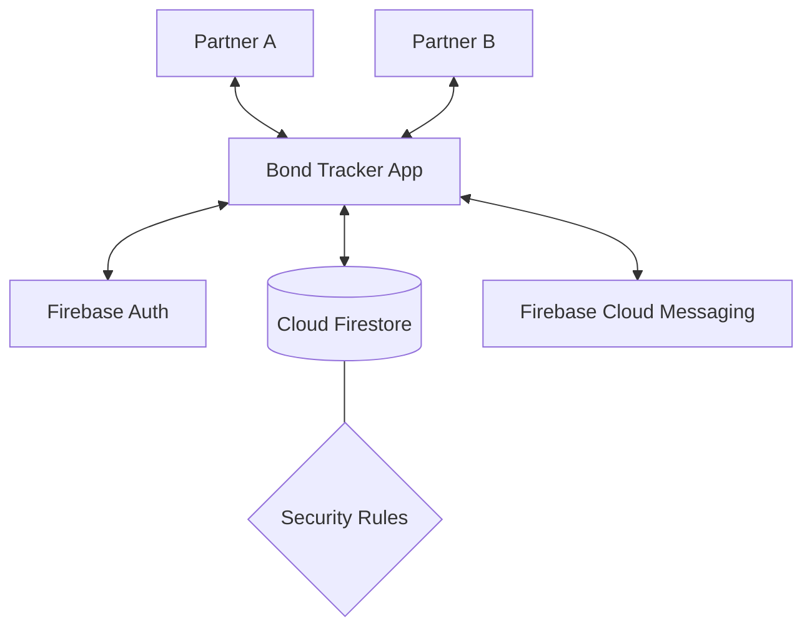
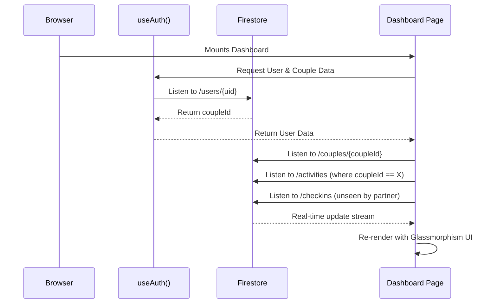
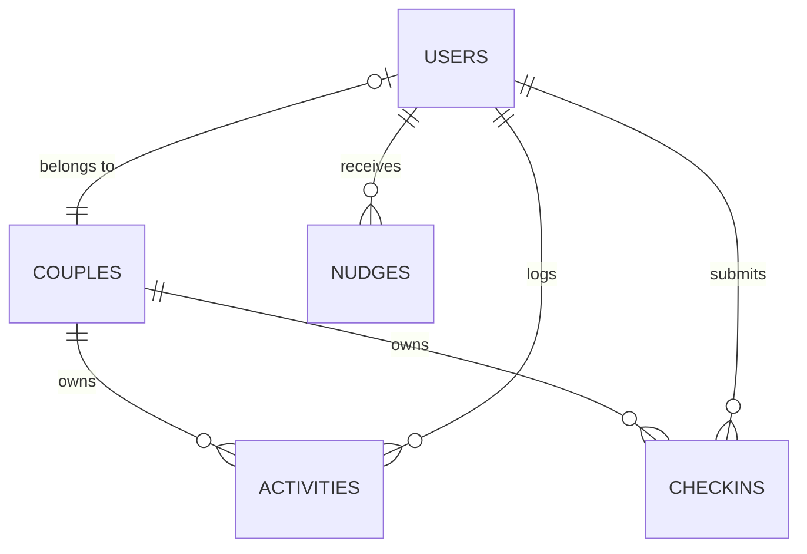

# 💜 Bond Tracker

A sleek, aesthetic couples productivity tracker built with **Next.js 14** and **Firebase**.  
Log your daily activities, track each other's progress, and grow together — privately, beautifully.

---

### 🏮 The Vision
Bond Tracker was born from the idea that relationships deserve their own dedicated, private space for productivity. While most apps focus on individual tasks, Bond Tracker focuses on the **shared effort** that keeps a relationship strong. Our mission is to provide an aesthetic, distraction-free environment that celebrates small wins and keeps partners connected across time and space.

---

## 📖 What is Bond Tracker?

**Bond Tracker** is more than just a logging tool—it's a shared digital space for couples. It focuses on **visibility**, **consistency**, and **emotional connection**, especially for those navigating long-distance relationships or busy schedules.

By logging just a few minutes of "Bond Time" each day, you build a shared history that can be celebrated through streaks and exported as a sentimental PDF report.

---

## 🚀 Getting Started (User Guide)

### 1. Onboarding
- **First Partner**: Sign up and click "Create a Couple". You'll get an 8-character **Invite Code**.
- **Second Partner**: Sign up and click "Join a Couple". Enter the code your partner gave you.
- **Result**: You are now linked! Your dashboard will immediately reflect your partner's status.

### 2. Logging Your First Activity
- Click the **"+" (Add Activity)** button at the dashboard bottom.
- Select an **Activity Type** (e.g., *Self-care* or *Learning*).
- Use the **Duration Slider** (15 mins to 8 hours).
- Add a **Note** if you want to share specifically what you did.
- **Sync**: Your partner's dashboard will update within seconds.

### 3. The 9 PM Ritual (Wind-Down)
Every night after **9:00 PM** (in your local time), the app will prompt you for a **Wind-Down Check-In**. 
- Rate your day from 1-5 stars. Pick a mood emoji. Write a short message.
- **Morning Surprise**: Your partner sees your note as a soft, glowing banner the next time they open the app.

---

## 🏗️ Technical Architecture

### System Overview


### Dashboard Data Flow


### Data Relationship Model


---

## 🧠 Technical Nuances & Logic

### 1. The "Today" Calculation
In long-distance relationships, "Today" is a moving target. 
- **The Engine**: App uses a custom `useTodayDate` hook that calculates the "YYYY-MM-DD" string based on the user's specific timezone.
- **The Result**: If Partner A is on Monday and Partner B is already on Tuesday, the app correctly separates their "Today's Rings" so no data is overwritten or miscalculated.

### 2. Streak Math 🔥
- A streak is counted if **any** activity is logged on a calendar day.
- The shared streak reflects your **combined consistency**. If both partners log at least one activity, the "Shared Streak" continues to grow.

### 3. Glassmorphism Design
The UI uses a **High-Contrast Glassmorphism** approach:
- **Background**: Multi-layered aurora blobs (`.aurora-bg`) with slow, non-linear CSS animations.
- **Cards**: `backdrop-filter: blur(20px)` with a very subtle `0.08` opacity border to simulate high-end frosted glass.
- **Typography**: Heavily utilizes **Syne** (a wide, brutalist font) for data points.

---

## 📁 Accurate Project Structure

```bash
bond-tracker/
├── app/
│   ├── api/                 # Backend edge functions (Nudges/FCM)
│   ├── dashboard/           # Main interactive hub + Stats logic
│   ├── onboarding/          # Couple creation & invite system
│   ├── globals.css          # Design system core (Aurora, Glass, Transitions)
│   ├── layout.js            # Root layout, Google Fonts, Viewport meta
│   └── page.js              # Auth gateway (Login/Sign Up)
├── components/
│   ├── Navbar.jsx           # Global nav + Export dashboard + Real-time sync indicator
│   ├── TimezoneOverlap.jsx  # The "Mirror" component with diagnostic ID
│   ├── ProgressRing.jsx     # Animated circular goal trackers
│   ├── ActivityFeed.jsx     # Real-time list of shared logs
│   ├── ActivityCalendar.jsx # Relationship heatmap
│   ├── ActivityPieChart.jsx # Category breakdown visualization
│   ├── WeeklyChart.jsx      # side-by-side 7-day volume chart
│   ├── LogModal.jsx         # Bottom-sheet for rapid activity logging
│   ├── ChallengeModal.jsx   # Interactive shared challenges
│   ├── GoalModal.jsx        # Visual goal setting
│   ├── WindDownModal.jsx    # Reflection flow (Rate/Mood/Note)
│   └── WindDownBanner.jsx   # Morning reveal of partner's note
├── hooks/
│   ├── useAuth.js           # Real-time user profile + active doc listener
│   ├── useInactivityLogout.js # Auto-logout security logic (15 min)
│   └── useTodayDate.js      # timezone-shifted relative date engine
├── lib/
│   ├── firebase.js          # Core SDK initialization (Client)
│   └── exportUtils.js       # JSON -> Blob -> PDF/CSV generation engine
├── firestore.rules          # THE privacy firewall (Couple-scoped isolation)
├── firestore.indexes.json   # High-performance composite query indexes
└── firebase.json             # Service-specific project configuration
```

---

## 🔐 Database Schema & Security

### Firestore Collections
| Collection | Role | Key Fields |
|------------|------|------------|
| `users` | User Profiles | `uid`, `coupleId`, `timezone`, `color`, `lastActive` |
| `couples` | Join logic | `members` (UID array), `inviteCode`, `thinkingOfYou` |
| `activities` | Core logs | `userId`, `coupleId`, `type`, `duration`, `date` |
| `checkins` | Nightly notes | `userId`, `coupleId`, `rating`, `mood`, `note`, `seenByPartner` |
| `nudges` | Pings | `toUserId`, `fromUserId`, `createdAt` |

### Security Philosophy
The `firestore.rules` file enforces **Couple-Scoped Isolation**.  
Example Rule Snippet:
```javascript
match /activities/{activityId} {
  allow read: if request.auth != null && 
    get(/databases/$(database)/documents/users/$(request.auth.uid)).data.coupleId == resource.data.coupleId;
}
```

---

Made with 💜 for couples everywhere.
