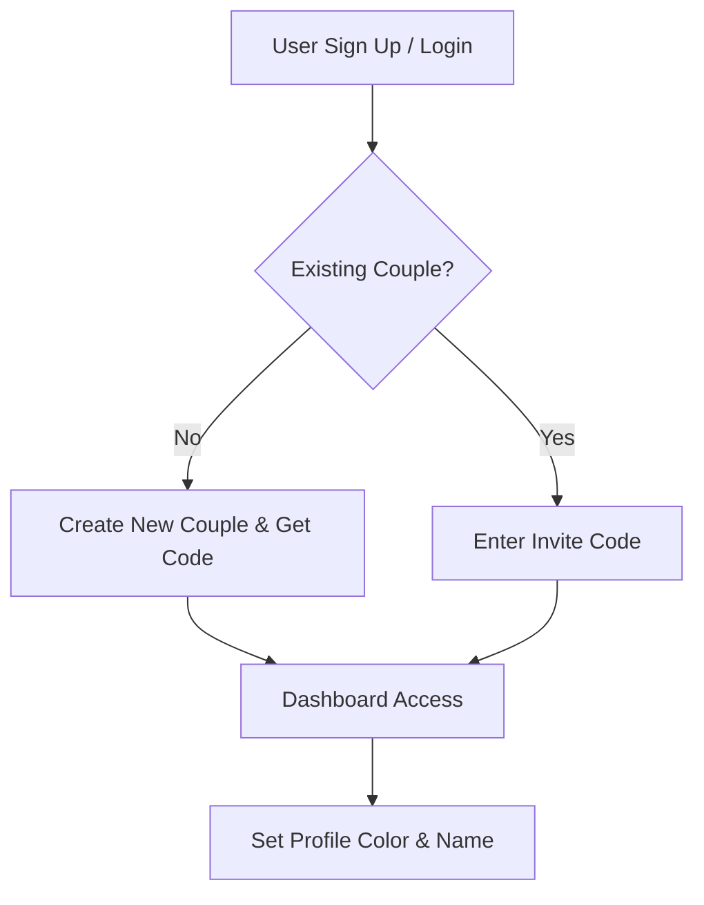
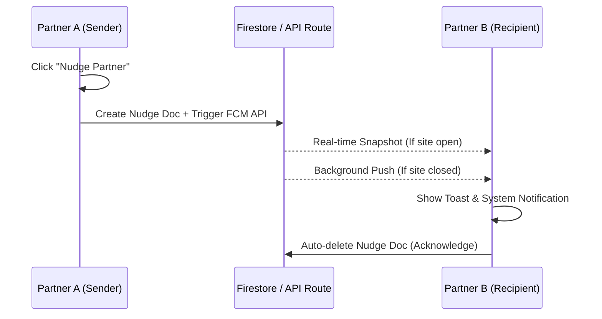
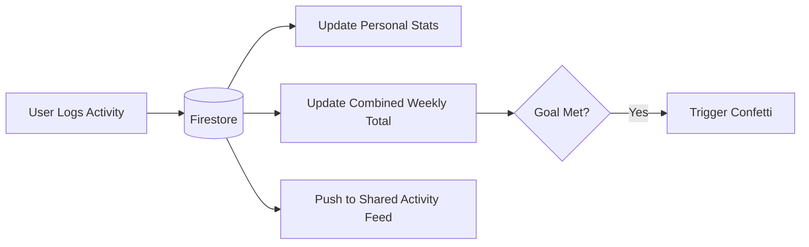

# Bond Tracker: Project Overview 💖

Bond Tracker is a collaborative web application designed for couples to track shared activities, celebrate milestones, and stay connected through real-time interactions.

---

## 🌟 Core Features

### 1. Shared Activity Logging
Users can log various types of activities (Work, Exercise, Learning, Creative, etc.) with custom notes and durations.
*   **Real-time Sync**: Activities appear instantly on your partner's dashboard.
*   **Timezone Awareness**: The app automatically handles different timezones, ensuring "Today" and streaks are accurate for long-distance partners.

### 2. Live Activity Feed & Reactions
A shared feed shows every activity logged by the couple.
*   **Interactions**: Partners can cheer each other on by clicking reactions like ❤️, 🔥, or 👏.
*   **Visual Feedback**: Reaction counts update live using Firestore's real-time listeners.

### 3. Nudge / Poke System 🔔
A dedicated tool for reminding your partner to stay active.
*   **In-App Toast**: If the partner has the website open, they get an instant "Nudge" notification.
*   **Background Push (FCM)**: Using Firebase Cloud Messaging, partners receive a system notification even if the browser tab is closed.

### 4. Custom Combined Weekly Goals
Set a shared target for combined activity hours each week.
*   **Shared Progress**: A visual ring tracks how close you are to hitting your goal together.
*   **Confetti Celebration**: Achieving the goal triggers a massive confetti explosion across the screen.

### 5. Smart Streak Tracking
The app calculates a "Shared Streak" based on consistency, encouraging both partners to log activities daily to keep the flame alive.

---

## 🏎️ Process Flows

### Onboarding & Couple Setup

### Nudge / Poke Flow

### Activity Logging & Sync

---

## 🛠️ Technology Stack
*   **Frontend**: Next.js 14, React, Tailwind CSS.
*   **Real-time & DB**: Google Firebase (Firestore).
*   **Authentication**: Firebase Auth (Email/Password).
*   **Push Notifications**: Firebase Cloud Messaging (FCM).
*   **Animations**: React Confetti, CSS Aurora Blobs.
*   **Hosting**: Vercel.
