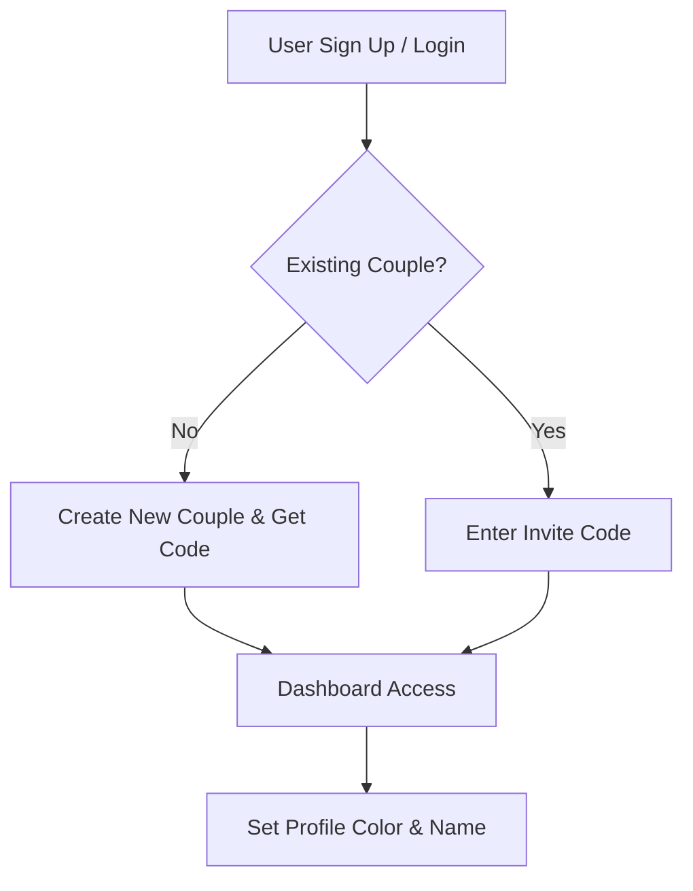
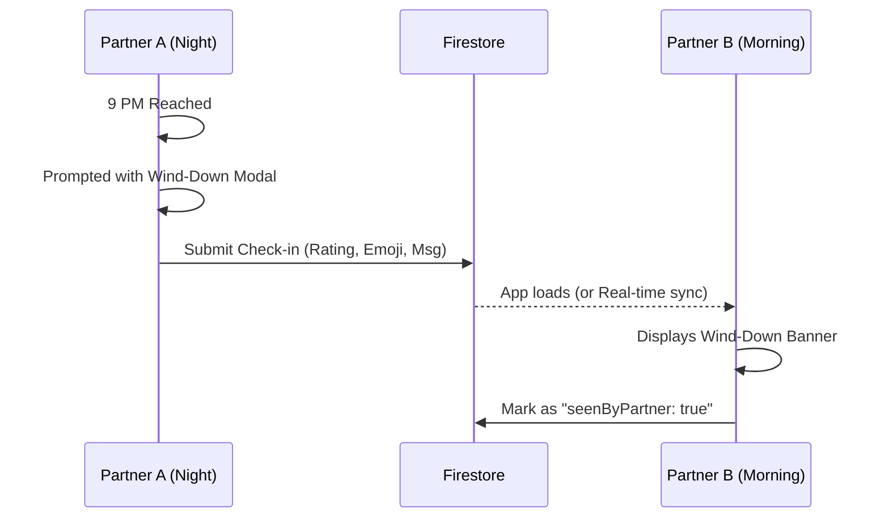
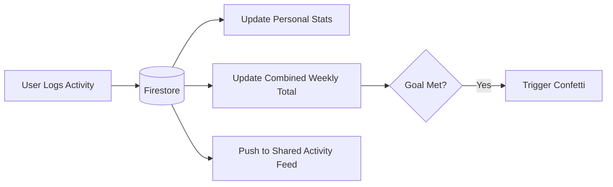

# Bond Tracker: Project Overview 💖

Bond Tracker is a collaborative web application designed for couples to track shared activities, celebrate milestones, and stay connected through real-time interactions.

---

## 🌟 Core Features

### 1. Shared Activity Logging
Users can log various types of activities (Work, Exercise, Learning, Creative, etc.) with custom notes and durations.
*   **Real-time Sync**: Activities appear instantly on your partner's dashboard.
*   **Timezone Awareness**: The app automatically handles different timezones. Users' "Today" boundaries and streaks correctly render for long-distance partners.

### 2. Daily Wind-Down Check-In 🌙
A thoughtful nightly ritual that triggers after 9 PM local time.
*   **Reflection**: Partners answer "How was your day?" with a 1-5 rating and a mood emoji.
*   **Partner Display**: When the other partner opens the app the next day, they see a beautiful, soft banner at the top displaying the check-in note, keeping them connected across schedules.

### 3. Data Export 📊
Your relationship data belongs to you.
*   **CSV Download**: Quickly pull raw data of all activities and check-ins into Excel or Google Sheets.
*   **Beautiful PDF Report**: Generate a formatted, print-ready document containing the couple's entire history, complete with custom styled tables matching the app's dark neon aesthetic.

### 4. Nudge / Poke System 🔔
A dedicated tool for reminding your partner to stay active or just say "I'm thinking of you".
*   **In-App Toast**: If the partner has the website open, they get an instant notification.
*   **Background Push (FCM)**: Using Firebase Cloud Messaging, partners receive a system notification even if the browser tab is closed.

### 5. Custom Combined Weekly Goals & Streaks
Set a shared target for combined activity hours each week.
*   **Shared Progress**: A visual ring tracks how close you are to hitting your goal together.
*   **Confetti Celebration**: Achieving the goal triggers a massive confetti explosion across the screen.
*   **Smart Streak Tracking**: Calculates a Shared Streak based on consistency, encouraging both partners to log activities daily to keep the flame alive.

### 6. Fully Responsive Glassmorphism UI
*   **Mobile-First Design**: Smooth, stacked interfaces on mobile with adaptive Tailwind classes, scaling fluidly all the way up to large monitors.
*   **Premium Visuals**: Custom aurora background animations, deep contrast glass cards, and precise micro-interactions ensure the app feels like a high-end product.

---

## 🏎️ Process Flows

### Onboarding & Couple Setup

### Wind-Down Check-In Flow

### Activity Logging & Sync

---

## 🛠️ Technology Stack
*   **Frontend**: Next.js 14, React, Tailwind CSS.
*   **Real-time & DB**: Google Firebase (Firestore).
*   **Authentication**: Firebase Auth (Email/Password).
*   **Push Notifications**: Firebase Cloud Messaging (FCM).
*   **Export Generation**: Client-side document window manipulation (`window.print()`) and Blob generation.
*   **Animations**: React Confetti, CSS Aurora Blobs.
*   **Hosting**: Vercel.
